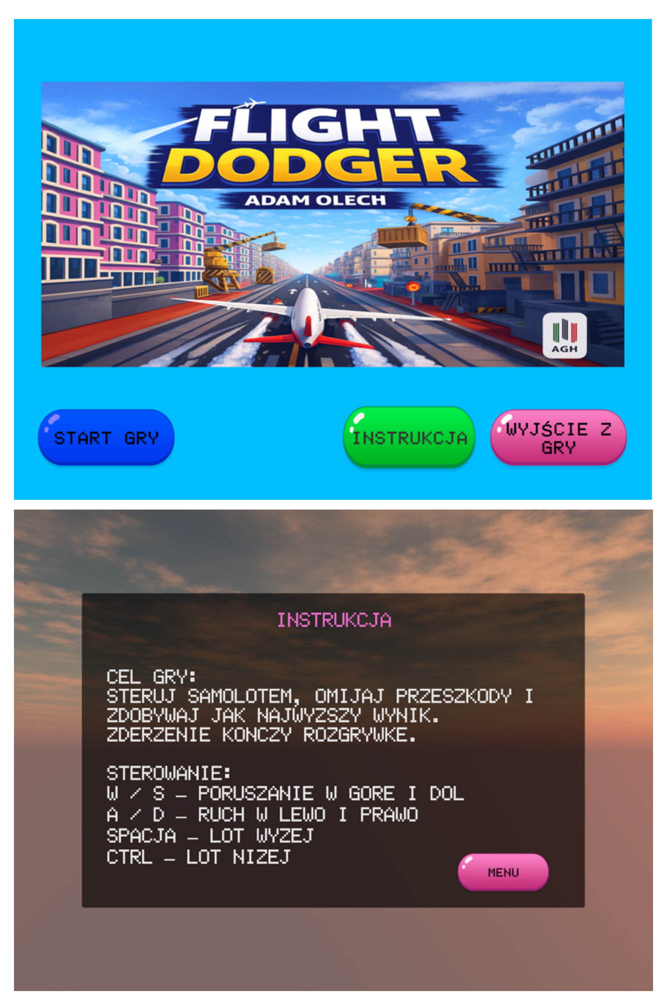
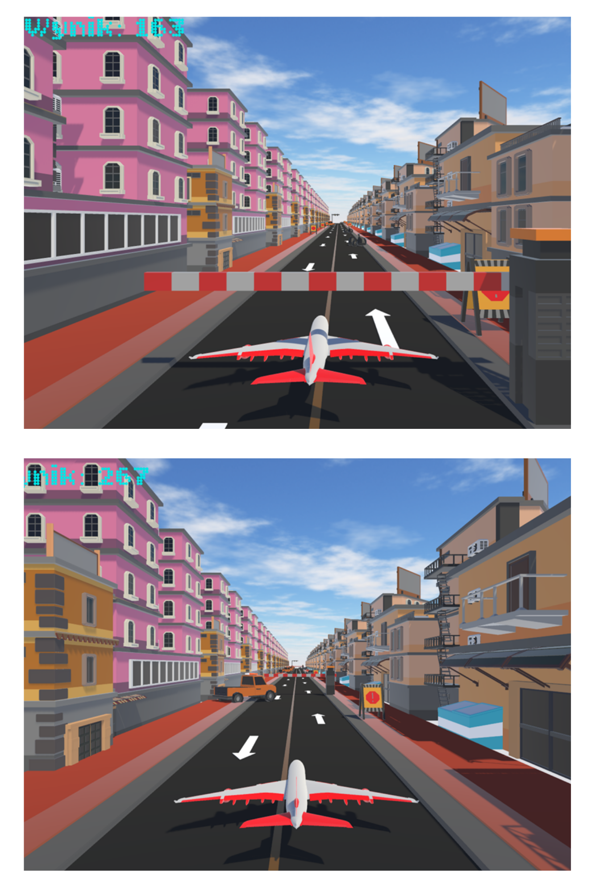
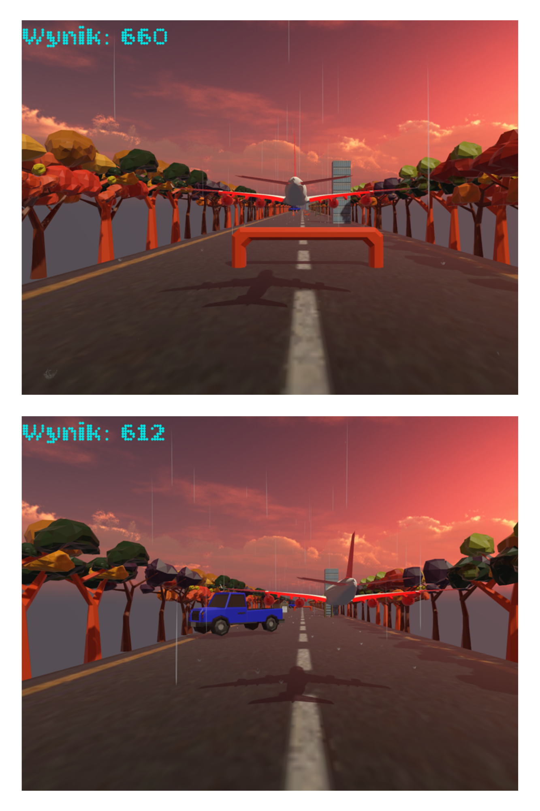

# Flight Dodger - Unity 3D Technical Showcase

## Gameplay Video
I have included a gameplay demonstration to show the mechanics in action without the need to build the project.

[Click here to watch the gameplay video](Flight_Dodger_demo.mp4)

---

## Core Logic & Implementation
This repository focuses on the **C# programming** and logic behind the game. Heavy 3D assets and library files have been excluded to keep the project clean and readable.

### Key Technical Components:
* **Procedural Generation (`GeneratorPodloza.cs`)**: A custom algorithm that dynamically spawns, positions, and destroys environment segments to create an infinite, non-repetitive world.
* **Physics Player Controller (`Gracz.cs`)**: Handles 3D movement using Unity's physics engine, including altitude control and collision response.
* **Game Management (`TheEnd.cs`)**: Controls the game loop, UI transitions, and real-time score calculation.

## Tools Used
* **Engine:** Unity
* **Language:** C#
* **Focus:** Scripting, Game Logic, Optimization.

## Screenshots
| Main Menu | Urban Flight | Forest Theme |
| :---: | :---: | :---: |
|  |  |  |
